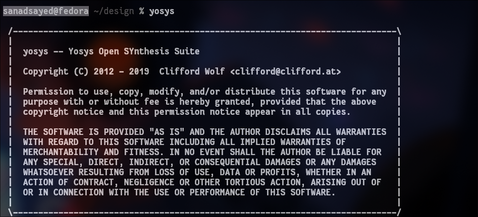
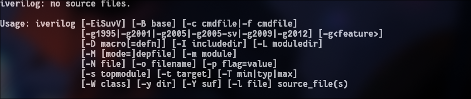
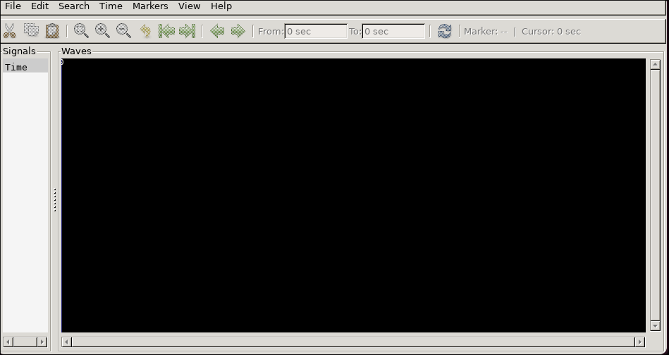
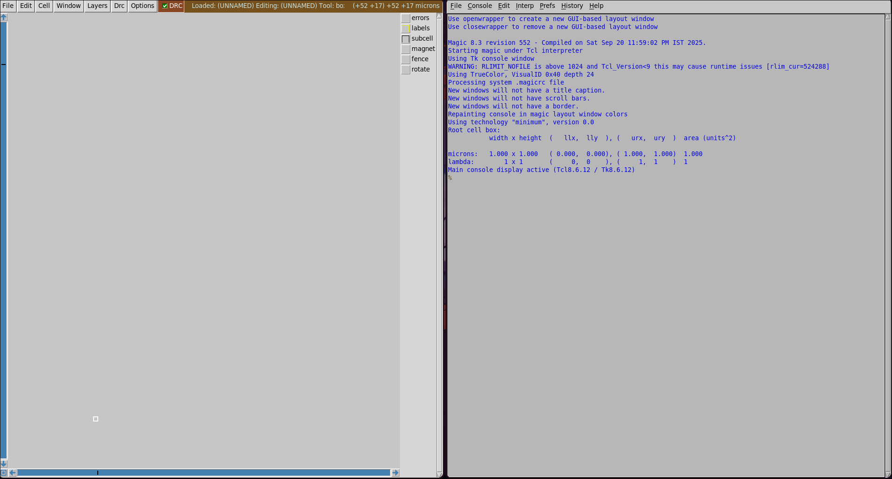
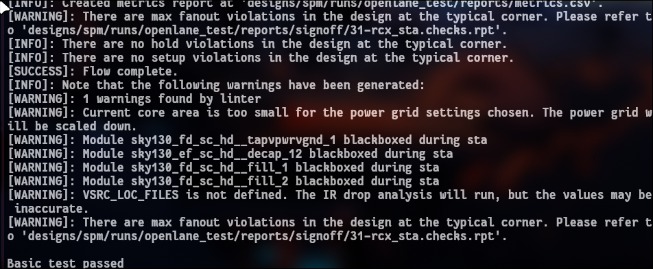

# 🚀 Week 0: Introduction and Foundational Concepts

<div align="center">


</div>

This week provided a comprehensive **introduction to the RISC-V tapeout program**, establishing the core principles and objectives that will guide the course.

---

## 💡 Key Learnings & Takeaways

### 🔑 The Modern Imperative of Chip Design
Chip design, fabrication, and testing skills are increasingly important in today’s tech-driven world. Mastery of these ensures competitiveness and innovation.

### 🌍 The Power of Open-Source Hardware
The **RISC-V ISA** and open-source EDA tools:
- Lower the financial barrier to entry.  
- Foster a global collaborative community.  
- Empower new designers with accessible standards.  

### 🤖 The Role of Automation and AI
Automation + AI tools reduce repetitive tasks, streamline workflows, and boost productivity.

### 🏭 ChipFoundry's Design Philosophy
Focus on **porting validated designs** → reduces complexity for engineers → more time for innovation.

---

## ⚙️ Tools Installed & Verified

<div align="center">

🧠 Yosys → 📟 Iverilog → 📊 GTKWave → 🎨 Magic VLSI


</div>

### 🧠 Yosys – RTL Synthesis Tool
✅ Converts RTL into gate-level designs.

<p align="center">
  
</p>

---

### 📟 Iverilog – Verilog Simulator
✅ Compiles and simulates Verilog code.

<p align="center">
  
</p>

---

### 📊 GTKWave – Waveform Viewer
✅ Debugs & visualizes simulation waveforms.

<p align="center">
  
</p>

---

### 🎨 Magic VLSI – Layout Tool
✅ Layout creation, editing, and DRC analysis.

<p align="center">
  
</p>

---


### 📟 Iverilog – Verilog Simulator
**Purpose:** IC layout editor with DRC.

**Installation:**  
```bash
    git clone https://github.com/The-OpenROAD-Project/OpenLane
    cd OpenLane
    make
    make test
```
**Verification:**  
<p align="center">
  
</p>

---

## 🎉 Installation Summary

<div align="center">

| Tool          | Status | Primary Use          |
|---------------|--------|----------------------|
| 🧠 **Yosys**  | ✅     | RTL Synthesis        |
| 📟 **Iverilog** | ✅   | Verilog Simulation   |
| 📊 **GTKWave** | ✅   | Waveform Analysis    |
| 🎨 **Magic**   | ✅   | Layout Design        |
|  **OpenLane**   | ✅   | RTL to GDC        |


</div>

---

<div align="center">

✨ **Environment ready for the VLSI Design Journey!** ✨

</div>
