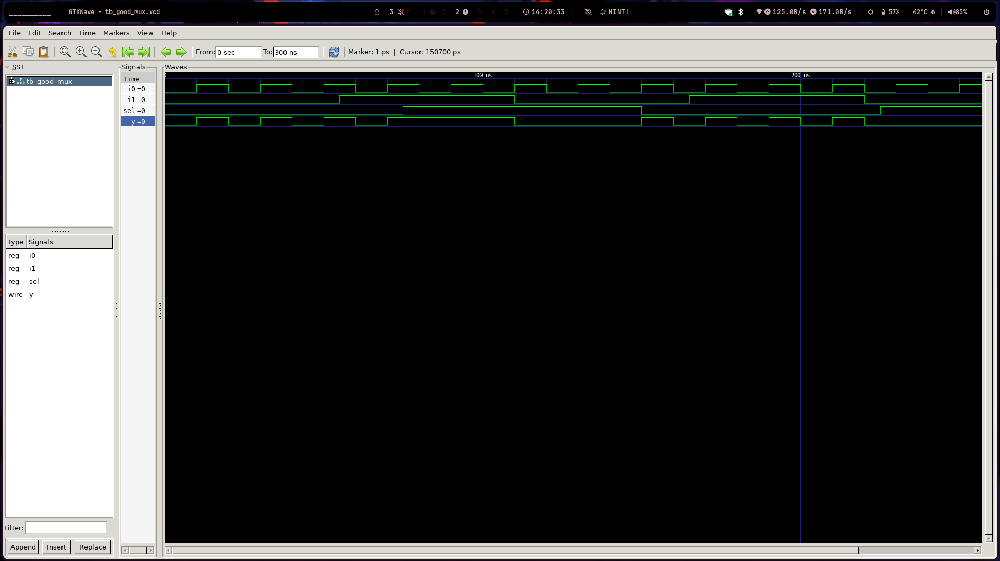
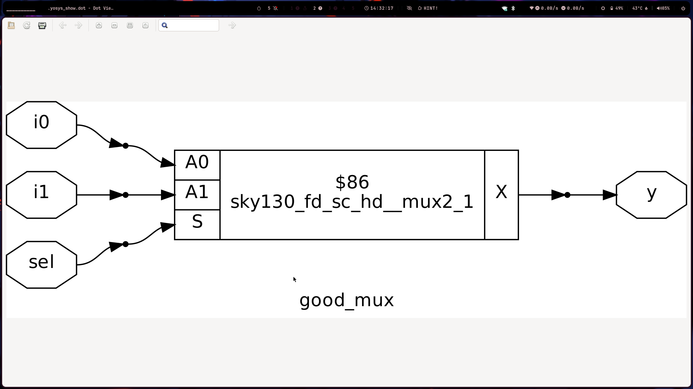

Day 1: Verilog RTL Design & Synthesis Workshop Notes 📝

Overview

Day 1 was an introduction to the fundamental concepts of RTL (Register-Transfer Level) design using Verilog, focusing on simulation with Icarus Verilog (iverilog) and logic synthesis with Yosys. I successfully simulated a simple 2-to-1 multiplexer and learned how to synthesize it into a gate-level netlist.

Key Concepts Learned

    Simulator: A software tool (like iverilog) used to verify a digital circuit's functionality by applying test inputs and observing outputs.

    Design: The Verilog code that describes the logic of the circuit (e.g., good_mux.v).

    Testbench: A separate Verilog module that provides the inputs and checks the outputs for the design under test (e.g., tb_good_mux.v).

    Synthesis: The process of converting a high-level HDL description (Verilog) into a low-level gate-level netlist, a blueprint for physical hardware.

    Gate Libraries (.lib files): Collections of different versions ("flavors") of standard logic gates (AND, OR, NOT). These different versions vary in properties like speed, area, power consumption, and drive strength, allowing synthesis tools to optimize the final circuit for specific goals.

    Yosys: An open-source synthesis tool that takes Verilog code and a gate library to produce an optimized gate-level netlist.

Labs & Practical Steps

Lab 1: Simulating a 2-to-1 Multiplexer with iverilog

    Clone the Repository:
    Bash

git clone https://github.com/kunalg123/sky130RTLDesignAndSynthesisWorkshop.git
cd sky130RTLDesignAndSynthesisWorkshop/verilog_files

Install Required Tools:
Since I'm using Fedora, I'll use dnf instead of apt.
Bash

sudo dnf install iverilog gtkwave

Simulation Flow:

    Compile the design (good_mux.v) and the testbench (tb_good_mux.v) into an executable simulation file.
    Bash

iverilog good_mux.v tb_good_mux.v

Run the simulation. This generates the waveform file (tb_good_mux.vcd).
Bash

./a.out

View the waveforms in GTKWave.

Bash

        gtkwave tb_good_mux.vcd

Lab 2: Synthesizing the Multiplexer with Yosys

    Start Yosys:
    Bash

    yosys

    Execute the Synthesis Script: I will read the gate library and the Verilog design file, then run the synthesis and technology mapping steps.

    Visualize the Netlist:
    The show command inside Yosys was a great way to visually inspect the resulting gate-level circuit.

My Takeaways & Next Steps

This was a fantastic introduction. It's clear that the design process involves two main stages:

    Simulation: Verifying the logic works as intended using a testbench.

    Synthesis: Converting that verified logic into a hardware-implementable circuit.

Understanding the role of gate libraries and why they contain different "flavors" of the same gate was a key insight. It highlights the importance of optimization in digital design.
