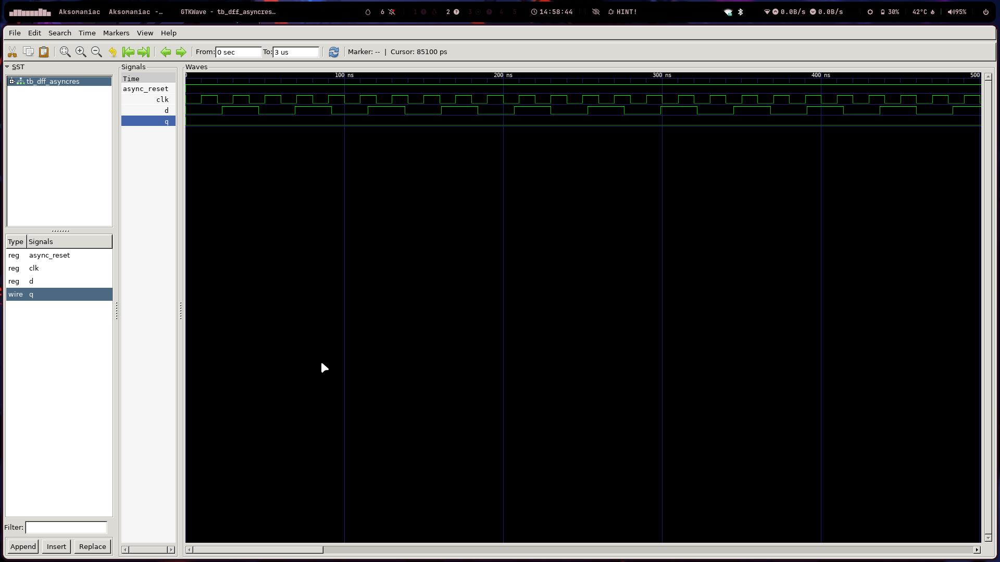
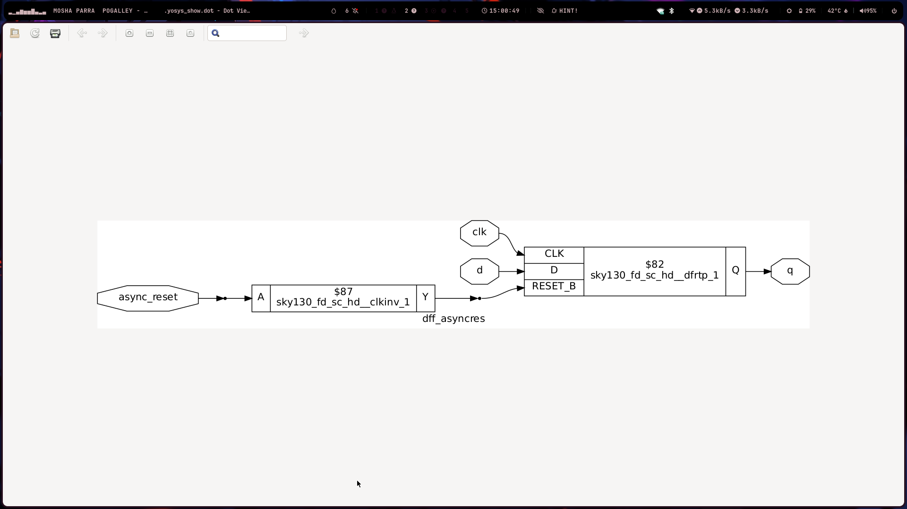

# Digital Design Lab: Flip-Flops and Synthesis Workflow

This lab was a deep dive into the foundational elements of sequential circuit design. We explored how to correctly model flip-flops in Verilog and gained hands-on experience with the entire RTL-to-netlist workflow, using an open-source toolchain with the SKY130 PDK. 🚀

---

## 📝 Key Concepts Learned

### SKY130 PDK Timing Libraries

The Process Design Kit (PDK) is the critical link between our abstract digital design and the physical reality of a silicon chip. We focused on the standard cell timing libraries (`.lib` files), which contain characterization data for the basic building blocks of our design.

A file named `sky130_fd_sc_hd__tt_025C_1v80.lib` tells us the exact conditions for which the cell data is valid:
* **`tt`**: The **T**ypical-**T**ypical process corner. This assumes that both NMOS and PMOS transistors have average, or "typical," performance characteristics from the manufacturing process.
* **`025C`**: The operating **temperature** is 25°C.
* **`1v80`**: The core supply **voltage** is 1.8V.

Understanding this PVT (Process, Voltage, Temperature) data is essential for accurate timing analysis.

### Synthesis Strategies: Hierarchical vs. Flattened

Synthesis is the automated process of converting our behavioral RTL description into a structural gate-level netlist. The strategy we choose impacts the final result.

* **Hierarchical Synthesis**: This approach maintains the module boundaries from our Verilog code. It's like building a car by assembling the engine, chassis, and transmission separately before putting them together. It's faster and much easier to debug because the final netlist structure mirrors our original design. However, it can miss optimization opportunities that exist between the modules.
* **Flattened Synthesis**: This method collapses the entire design hierarchy into one single, massive module before optimization. This allows the tool to perform aggressive, whole-design optimizations, potentially leading to a smaller and faster circuit. The trade-off is significantly longer synthesis time and a netlist that is very difficult to debug, as the original RTL structure is lost.

### Flip-Flop Coding Styles

The way we write Verilog code for flip-flops is not just a matter of style; it directly dictates the hardware that gets synthesized.

* **Asynchronous Reset/Set**: The state change is immediate upon a change in the reset/set signal, regardless of the clock. This is achieved by including the reset signal in the sensitivity list of the `always` block (e.g., `always @ (posedge clk, posedge async_reset)`).
* **Synchronous Reset**: The reset only takes effect on the active edge of the clock. The reset condition is checked *inside* a clocked `always` block (e.g., `always @ (posedge clk)`). This generally leads to a safer design that is easier to analyze for timing.

---

## 🛠️ Lab Workflow & Commands

### Simulation Workflow (Icarus Verilog)

The primary goal of simulation is to verify the *functional correctness* of the design before moving to the more complex synthesis stage.

1.  **Compile**: `iverilog dff_asyncres.v tb_dff_asyncres.v -o sim_output`
2.  **Run**: `./sim_output`
3.  **View Waveform**: `gtkwave tb_dff_asyncres.vcd`



### Synthesis Workflow (Yosys)

Synthesis transforms the verified RTL into a gate-level netlist using the standard cells defined in the SKY130 library.

1.  **Launch Yosys**: `yosys`
2.  **Execute Synthesis Script**:
    ```yosys
    # Load the library of standard cells
    read_liberty -lib /path/to/sky130_fd_sc_hd__tt_025C_1v80.lib

    # Read in the Verilog design
    read_verilog dff_asyncres.v

    # Perform technology-independent synthesis
    synth -top dff_asyncres

    # Map the generic flip-flops to specific cells from the library
    dfflibmap -liberty /path/to/sky130_fd_sc_hd__tt_025C_1v80.lib

    # Map the remaining combinatorial logic (AND, OR, etc.) to library cells
    abc -liberty /path/to/sky130_fd_sc_hd__tt_025C_1v80.lib

    # Display the final gate-level schematic
    show
    ```

---


---
## 🤔 Personal Reflection & Takeaways

### The "Synthesizable Subset" of Verilog

My biggest "aha!" moment was realizing that not all valid Verilog code is synthesizable. During simulation, I can use features like `#10` delays or `initial` blocks within a module to model behavior, and it works perfectly. However, synthesis tools can't turn these into standard gates. This lab drove home the point that when writing RTL, I'm not just writing code; I'm **describing hardware**. I need to constantly think, "What combination of flip-flops and logic gates will this code produce?"

### The Liberty File is the "Dictionary"

I used to see the `.lib` file as just another configuration file. I now understand that it's the **dictionary** that translates the abstract language of Verilog into the concrete vocabulary of the SKY130 standard cells. When Yosys sees a `+` operator, it looks into the liberty file to find the best adder cell available, considering its timing, area, and power characteristics. Without this file, synthesis would be impossible. It's the absolute foundation of the physical design flow.

### Asynchronous vs. Synchronous Resets: A Design Trade-Off

The choice between asynchronous and synchronous resets is more nuanced than I first thought. An asynchronous reset seems great because it's fast and doesn't require a clock. However, I learned that if the reset signal is removed at or near a clock edge (de-assertion), it can lead to metastability, which is a huge issue. A synchronous reset is safer because it's predictable and timed with the system clock, but it requires more logic in the data path. This lab taught me that there's rarely a single "best" solution in digital design—it's always a series of **engineering trade-offs**.
