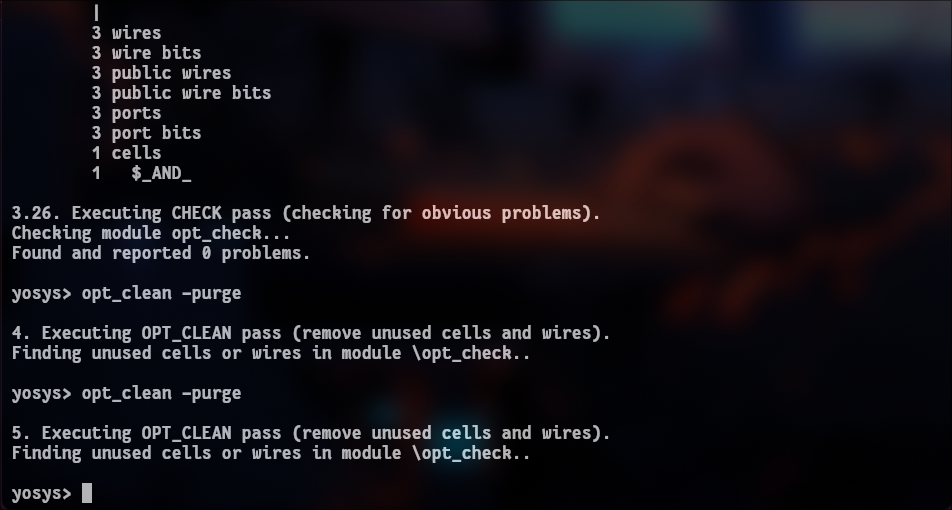
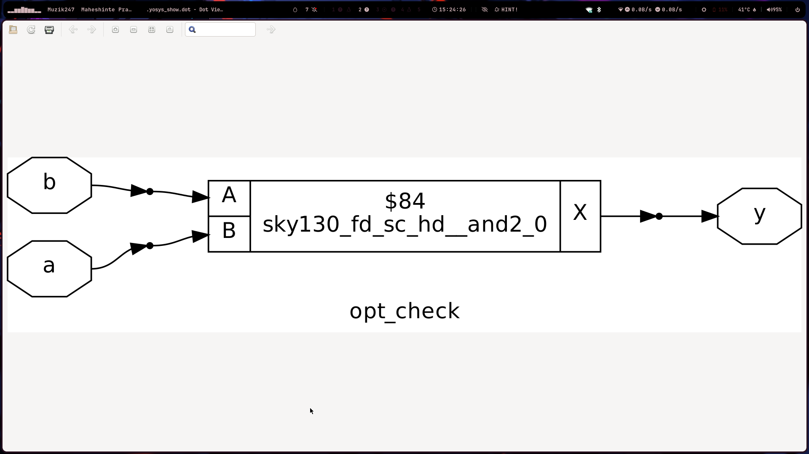

# Digital Design Lab: Combinational and Sequential Optimization

Today's session was focused on a critical aspect of digital design: **optimization**. We explored how modern synthesis tools are not just translators but are intelligent partners that simplify, shrink, and speed up our designs. The labs provided a practical demonstration of how seemingly complex Verilog can be reduced to highly efficient hardware. 🧠

---

## 📝 Key Concepts Learned

### Constant Propagation

This is a powerful optimization where the synthesis tool identifies signals or variables that are tied to a constant value (like `1'b0` or `1'b1`). It then propagates this constant through the logic, simplifying or eliminating gates entirely. For instance, an AND gate with one input tied to `0` is always `0`, so the tool can replace the entire gate with a direct connection to ground.

### State Optimization

This applies to Finite State Machines (FSMs). The core idea is to make the FSM as efficient as possible. This can involve:
* **State Reduction**: Merging states that have identical behavior and outputs.
* **State Encoding**: Choosing the best binary representation for each state (e.g., one-hot, binary, gray) to minimize the combinational logic needed to determine the next state and outputs.

### Cloning

Cloning is a physical optimization technique where a single logic cell driving many other cells (i.e., having a high fanout) is duplicated. Each "clone" then drives a smaller subset of the original load. This is a classic strategy to fix timing violations by reducing the electrical load and signal delay on critical paths.

### Retiming

Retiming is a clever sequential optimization that **moves registers (flip-flops) across combinational logic** without changing the circuit's function. The goal is to balance the delay between registers, which allows the circuit to be run at a higher clock frequency. It's like redistributing the workload on an assembly line to remove bottlenecks, making the entire line faster.

---

## 🛠️ Lab Workflow & Commands

The lab workflow was similar to previous days but introduced a key new optimization command, `opt_clean`.

<div style="text-align: center;">
  
</div>
---

### Synthesis Workflow (Yosys)

The goal was to write various Verilog modules and observe how the synthesis tool optimized them away.

1.  **Launch Yosys**: `yosys`
2.  **Execute Synthesis Script**:
    ```yosys
    # Load the technology library
    read_liberty -lib /path/to/sky1_fd_sc_hd__tt_025C_1v80.lib

    # Read the Verilog design
    read_verilog <your_verilog_file>.v

    # Run the high-level synthesis command
    synth -top <your_top_module>

    # NEW STEP: Perform generic optimizations like removing unused cells
    opt_clean -purge

    # Map the logic to the specific standard cells in the library
    abc -liberty /path/to/sky1_fd_sc_hd__tt_025C_1v80.lib

    # Display the final, optimized gate-level schematic
    show
    ```

---

<div style="text-align: center;">
  
</div>
## 🤔 Personal Reflection & Takeaways

### Synthesis Tools are Much Smarter Than I Am

My main takeaway is the sheer power of modern logic synthesizers. In Lab 4, I analyzed the code `assign y = a?(b?(a & c ):c):(!c);` and thought it was quite complex. My manual simplification was `y = a ? c : !c;`. When I ran it through Yosys and used the `show` command, the tool had independently reached the *exact same simplified conclusion*. It correctly identified that the state of input `b` was irrelevant if `a` was true. This was a powerful demonstration that my job is to describe the correct *behavior*, and the tool's job is to find the most efficient *implementation*.

### Hardware Has "Dead Code" Too

Labs 5 and 6 were incredibly insightful. In Lab 6, the flip-flop's output was set to `1` during reset and was also assigned `1` during normal operation (`q <= 1'b1;`). The synthesis tool recognized this redundancy. Instead of implementing a full flip-flop with clock and reset pins, it optimized the entire module away and simply tied the output `q` directly to the power rail (VDD or logic 1). This is the hardware equivalent of a compiler removing dead or unreachable code. It proves that the tool doesn't just blindly translate—it analyzes and fundamentally simplifies the circuit's purpose.

### The Importance of an Ordered "Recipe" for Synthesis

The introduction of the `opt_clean -purge` command highlighted that synthesis is not a single command but a **sequence of ordered steps**—a recipe. We run `synth` first to get a generic gate-level implementation. Then, we run optimization passes like `opt_clean` to tidy up this generic netlist. Finally, we run `abc` to map the cleaned-up generic logic onto the specific, physical cells available in our technology library. Performing these steps out of order would lead to a suboptimal result, much like baking a cake by mixing the ingredients in the wrong sequence.
