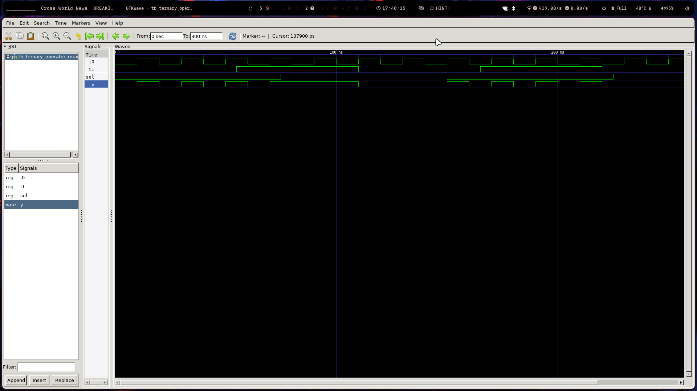
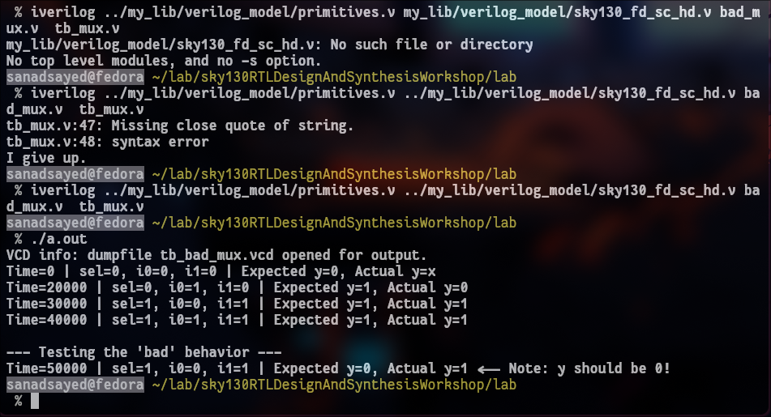
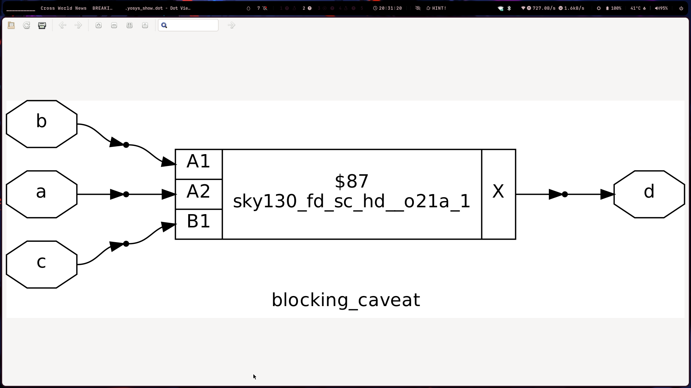

# Digital Design Lab: Gate-Level Simulation & RTL Best Practices

Today’s session was a crucial bridge between the abstract world of RTL design and the concrete reality of a synthesized hardware netlist. We explored **Gate-Level Simulation (GLS)**, the causes of **synthesis-simulation mismatch**, and drilled down into one of the most fundamental (and error-prone) concepts in Verilog: **blocking vs. non-blocking assignments**. This lab was all about ensuring that what we simulate is what we'll actually build. 🌉

---

## 📝 Key Concepts Learned

### Gate-Level Simulation (GLS)

GLS is the process of simulating the **gate-level netlist** that the synthesis tool generates. Unlike RTL simulation which checks our design's *intended behavior*, GLS verifies the *implemented behavior* of the actual circuit of AND, OR, and DFF gates. It serves as a critical sanity check to confirm that the synthesis tool correctly interpreted our RTL and that the resulting circuit meets functional and (later) timing requirements.

### Synthesis-Simulation Mismatch

This is a dreaded scenario where the pre-synthesis RTL simulation passes, but the post-synthesis GLS fails. It means our original code and the synthesized hardware do not behave identically. The primary causes are:
* **Non-synthesizable Verilog**: Using constructs like `#delays` or `initial` blocks that a simulator understands but a synthesis tool cannot convert into hardware.
* **Ambiguous Coding**: Writing code that can be interpreted in multiple ways, such as an `if` statement without an `else` in combinational logic, which can cause the tool to infer an unintended latch.
* **Improper Sensitivity Lists**: Forgetting to include all inputs in the sensitivity list of a combinational `always` block.

### Blocking (`=`) vs. Non-Blocking (`<=`) Assignments

This is the most important coding discipline in Verilog. Understanding the difference is key to avoiding mismatches and designing correct hardware.

* **Blocking (`=`)**: Assignments are executed **sequentially, in order**, within a block. The next line of code is "blocked" until the current assignment is complete. This behavior is ideal for describing **combinational logic**, where outputs should update immediately based on a chain of logic.
* **Non-Blocking (`<=`)**: All assignments are **scheduled to happen concurrently** at the end of the current simulation time step. The right-hand side of all statements is evaluated first, and only then are the left-hand side variables updated. This behavior perfectly models the nature of **sequential logic** (flip-flops), where all registers capture their new values simultaneously on the clock edge.

---

## 🛠️ Lab Workflow & Commands

### Synthesis Workflow (Yosys)

The first step was to synthesize our RTL design (like the MUX) into a gate-level netlist. This follows the standard flow.

```yosys
# Inside Yosys
read_liberty -lib /path/to/sky130_fd_sc_hd__tt_025C_1v80.lib
read_verilog <design>.v
synth -top <module_name>
abc -liberty /path/to/sky130_fd_sc_hd__tt_025C_1v80.lib
show
Gate-Level Simulation (GLS) Workflow

After generating the netlist, we simulate it instead of our original RTL. The command is more complex because we must include the Verilog models for the standard cells used in the netlist.
Bash

# Compile the netlist, testbench, and SKY130 cell models together
iverilog /path/to/primitives.v /path/to/sky130_fd_sc_hd.v <netlist_output>.v <testbench>.v

# Run the simulation and check the waveform
./a.out
gtkwave dump.vcd
```
#synthesis of mux using yosys

<div style="text-align: center;">
  
</div>

#GLS of Mux :


<div style="text-align: center;">
  
</div>

#badmux warning

<div style="text-align: center;">
  
</div>

#synthesis of caveat

<div style="text-align: center;">
  
</div>
---
🤔 Personal Reflection & Takeaways

The Golden Rule: <= for posedge, = for *

Today, the difference between blocking and non-blocking assignments finally clicked into a simple, unbreakable rule for me: Use non-blocking (<=) for sequential logic (always @(posedge clk)), and use blocking (=) for combinational logic (always @(*)). Following this isn't just "good practice"—it's fundamental to describing hardware correctly. Using blocking assignments for a flip-flop would create a race condition where the output of one flop could be used in the same clock cycle to calculate the input of the next, which isn't how physical registers work. This rule single-handedly prevents a huge class of synthesis-simulation mismatches.

GLS is Our First "Reality Check"

I now see the design flow as a series of reality checks, and GLS is the first and most important one. RTL simulation feels like programming—it checks my logic in a perfect, abstract world with no concept of gates or delays. But GLS is different. By simulating the actual netlist produced by Yosys and including the SKY130 primitive models, we are testing a blueprint of the real hardware. When a GLS passes, it gives me confidence that the synthesis tool understood my intent. When it fails, it's a direct signal that my RTL was ambiguous or flawed in a way that led to faulty hardware.

The Danger of "Hidden State" in Combinational Logic

The "blocking caveat" lab was a huge eye-opener. The code d = x & c; x = a | b; looked harmless, but it's a disaster. Because blocking assignments are sequential, the calculation for d uses the old value of x from the previous time the block was triggered. The synthesis tool is forced to infer a latch to store this old value, creating an unintended "hidden state" in what should be stateless combinational logic. This is a nightmare for timing analysis and can cause bizarre glitches. The simple fix of reordering the lines (x = a | b; d = x & c;) completely changes the hardware. It taught me that in Verilog, the order of statements has real physical consequences.
