# Digital Design Lab: Advanced Synthesis and Structural Modeling

Day 5 was about moving from simple logic descriptions to writing smarter, more scalable Verilog. We tackled one of the most common pitfalls in RTL design—**inferred latches**—and then explored powerful constructs like **for loops** and **generate blocks** to build complex hardware from simple, repeatable patterns. This session was all about making the synthesis tool's job easier and our designs more robust. 🛠️

---

## 📝 Key Concepts Learned

### The Danger of Inferred Latches

A **latch** is a level-sensitive memory element. While sometimes used intentionally, they are often created by accident in combinational logic (`always @(*)` blocks). This happens when we fail to specify the value of an output for **every possible combination of inputs**. If a condition is met, the output is assigned, but if it's not, what happens? The synthesis tool's only option is to infer that the output must hold its previous value, which requires creating a latch. These are dangerous because they can be transparent, leading to race conditions and making timing analysis extremely difficult. The golden rule is to always ensure complete assignments in combinational logic, either with a comprehensive `if-else` chain or a `default` case.

### Synthesizable For Loops: Unrolling Hardware

A `for` loop in Verilog is fundamentally different from one in a software language like C or Python. Instead of executing sequentially over time, a synthesizable `for` loop is **unrolled** by the synthesis tool at compile time to create parallel hardware. For example, a loop that iterates 4 times doesn't run four times; it creates **four copies** of the logic within the loop. This makes it an incredibly powerful tool for describing regular, repetitive logic structures like multiplexers or demultiplexers without tedious copy-pasting.

### Generate Blocks: The Hardware Factory

`Generate` blocks take the concept of unrolling one step further. They are Verilog's primary mechanism for **procedural hardware generation**. Using a `generate-for` loop, we can create multiple instances of modules or logic blocks, effectively building large, structured circuits like adders, multipliers, or memory arrays from a simple, looping description. This is the key to writing scalable and parameterizable RTL. The 8-bit Ripple Carry Adder lab was a perfect example, where a loop was used to instantiate and chain together 8 full-adder modules.

---

## 🔬 Labs & Synthesis Results

### Lab 1 & 2: Incomplete `if` Statement (Latch Inference)

This lab demonstrated how a simple `if` statement without an `else` clause forces the synthesizer to create a latch to hold the previous state of the output `y`.

* **Synthesis Result:**
### bad if result

  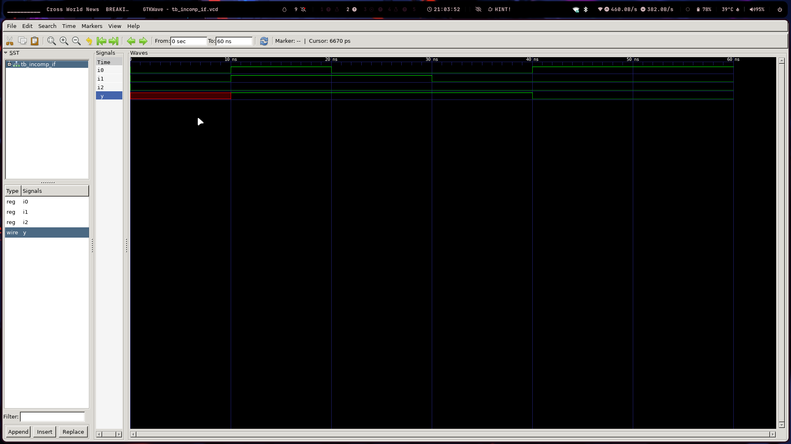

### synthesis of lab 1 

  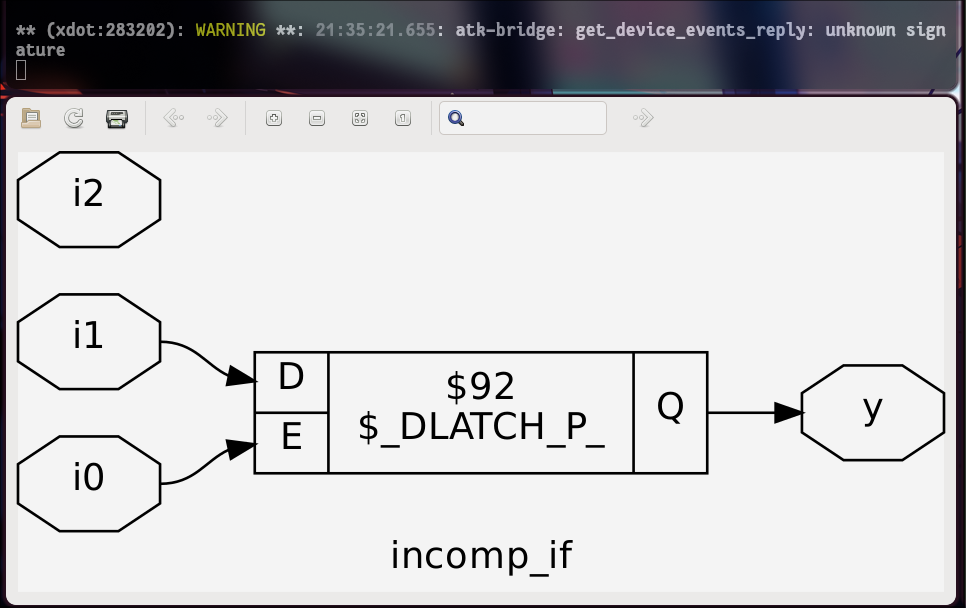

### Lab 3 & 4: Nested Incomplete `if-else` (Latch Inference)

This lab showed that even with nested logic, if any possible path through the conditions is not covered, a latch will still be inferred.

* **Synthesis Result:**

### gtkwave output 

  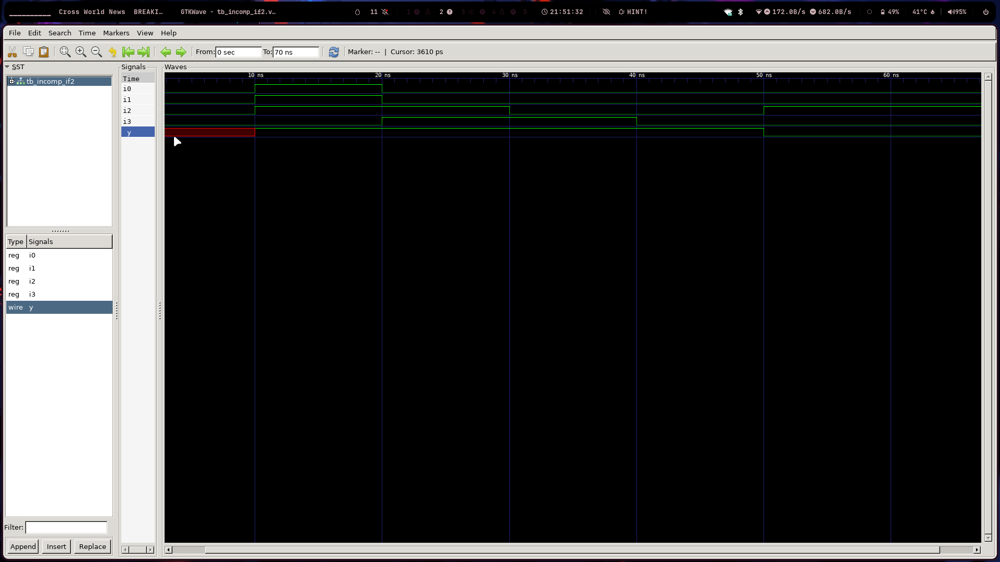

### synthesis of lab3 

  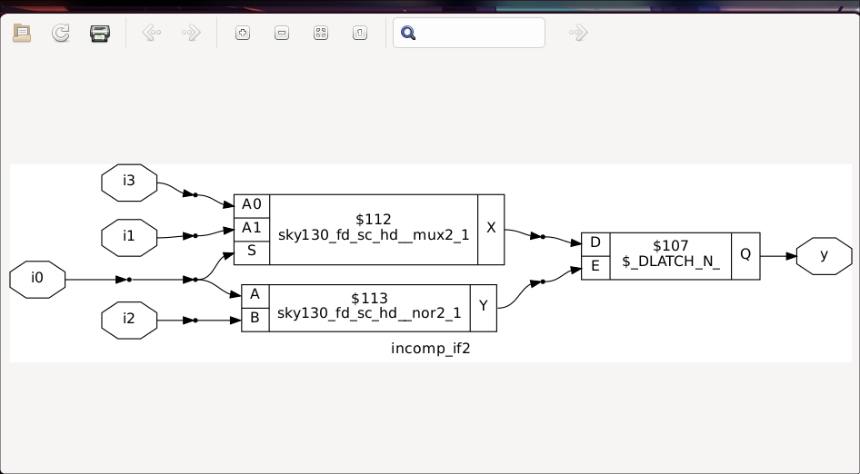

### Lab 5 & 6: Complete `case` Statement (Correct MUX)

### gtkwave output 

  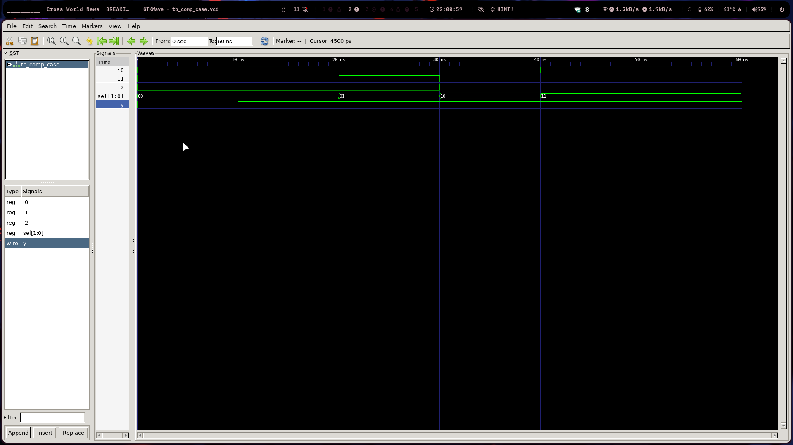

### synthesis of lab5 

  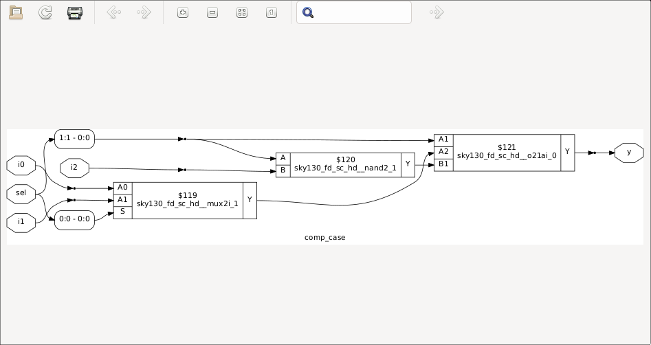

By using a `default` case, we ensured that the output `y` was assigned a value for all possible values of the `sel` input, resulting in clean, latch-free combinational logic (a multiplexer).

### Lab 9: 4-to-1 MUX using a `for` Loop

Here, we successfully created a 4-to-1 multiplexer by using a `for` loop. The synthesis tool unrolled the loop to create the parallel logic structure of a MUX.

* **Synthesis Result:**
    
### Lab 7: Incomplete Case Handling

  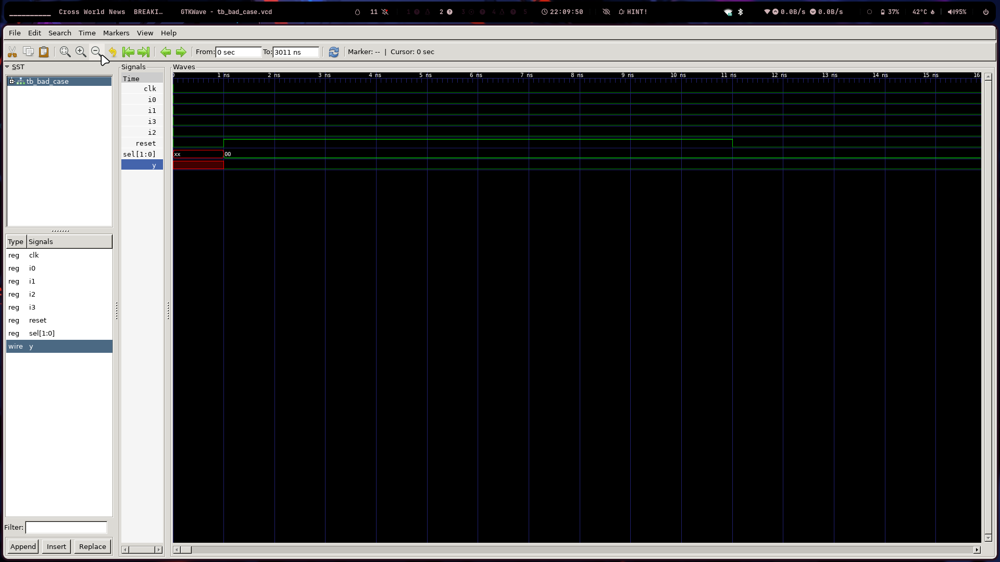

### Lab 8: Partial Assignments in Case

  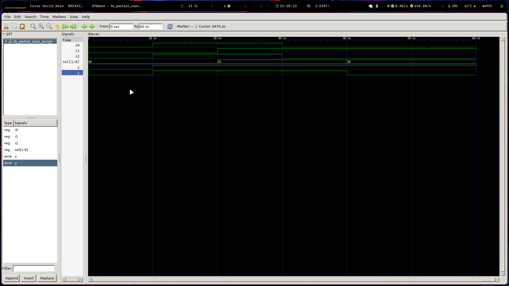

### Lab 9: 4-to-1 MUX Using For Loop

  

### Lab 10: 8-to-1 Demux Using Case

  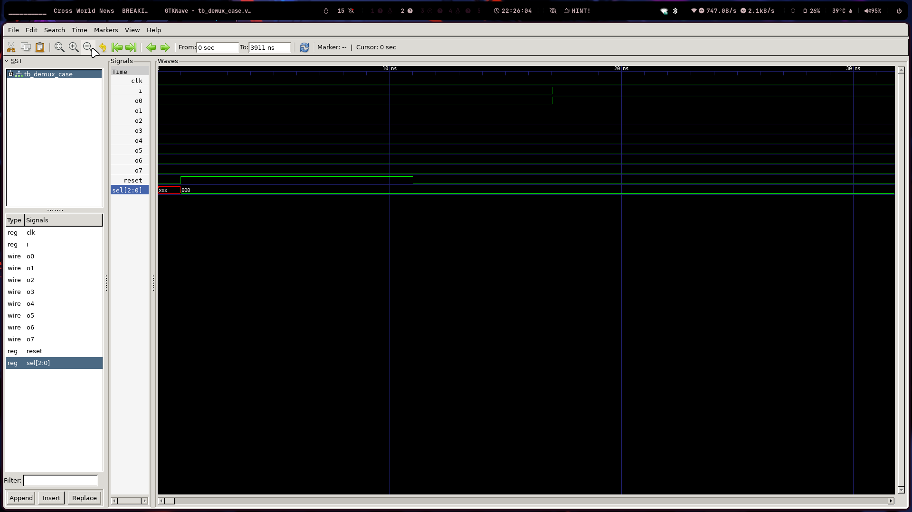

### Lab 11: 8-to-1 Demux Using For Loop

  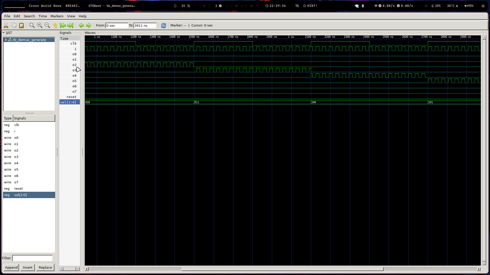

### Lab 12: 8-bit RCA using a `generate` Block

This lab demonstrated the power of the `generate` block to create a structural Ripple Carry Adder by instantiating and wiring up a chain of 8 `full_adder` modules.

* **Synthesis Result:**

  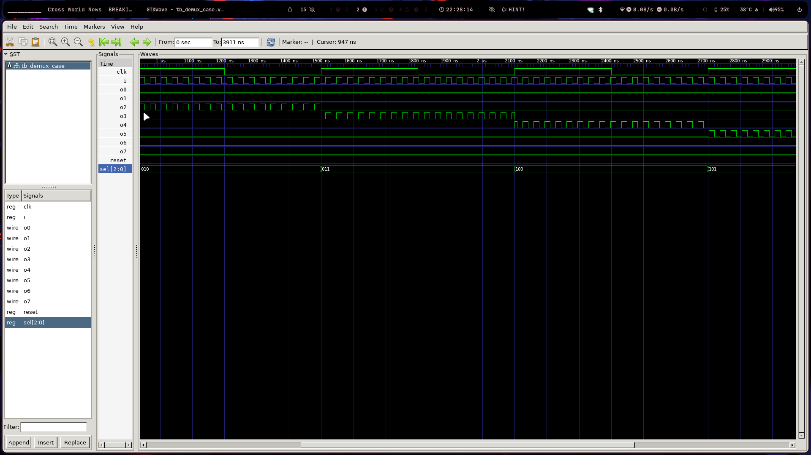

---

## 🤔 Personal Reflection & Takeaways

### Combinational Logic Must Have No Memory

The concept of inferred latches finally clicked for me with a simple mental model: **combinational logic cannot have memory**. When I write an `always @(*)` block, I have to be able to answer "yes" to the question, "Does my output have a clearly defined value for every single possible input combination and every path through my code?" If the answer is "no," it means the circuit must "remember" what it was doing before, and that memory is an unintended latch. This principle makes it obvious why incomplete `if` or `case` statements are so problematic.

### For Loops Describe Patterns, Not Processes

I had to completely re-wire my brain's understanding of a `for` loop. In software, a loop is a temporal process that executes over time. In Verilog synthesis, a `for` loop is a **spatial pattern description**. It tells the synthesizer, "Make N copies of this hardware." The loop in the MUX lab didn't run 4 times; it was unrolled to create the 4 parallel data paths that make up a multiplexer. The same is true for `generate` blocks. They are like blueprints for a hardware factory, not a sequence of steps for a CPU.

### Defensive Coding: The Power of a Default Assignment

A key takeaway for me is the importance of defensive coding in RTL. The labs on the DEMUX and complete `case` statements showed a powerful and simple habit: **assign a default value to all outputs at the very beginning of an `always` block**. For example, `y_int = 8'b0;`. This acts as a safety net. It guarantees that every signal has a known state, and even if I accidentally miss a condition in my `case` or `if` logic later, a latch won't be inferred. The tool will simply use the default value. It makes the code safer and my design intent crystal clear.
