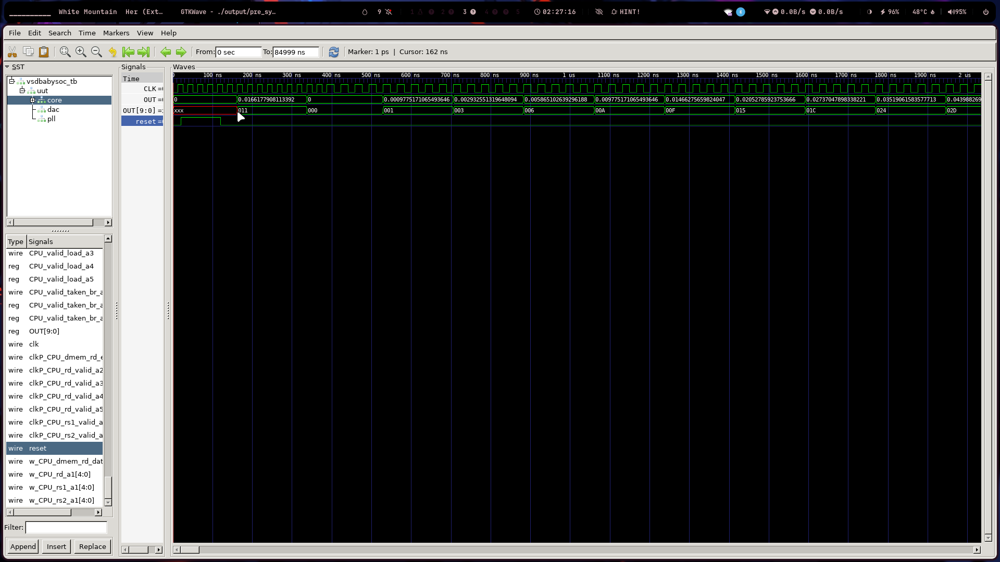
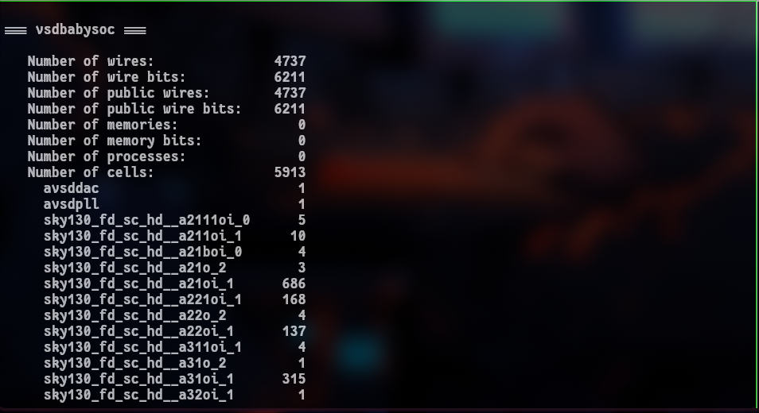

### BabySoC a dive into world of SoC

---

**Note** : The given readme is my understanding after reading the writing on BabySoC 

---
a system-on-chip is a complete system consisting of a cpu, memory, gpu, DAC, ADC etc..
they could be thought as complete package designed either for general computation or
for specific computation .The advantage of going with soc is the efficiecy comes with the tight integration of components. SoC are know for thier efficiency , cost and reliability. Contrast to individual manufacturing SoC comes with tighter integration and increased reliability comes with lower number of parts.Another huge advantage is small size making it amazing choice for mobile phone and other handheld devices.

### Components of SoC

CPU : The computational brain of the SoC, often based on architectures like RISC-V, ARM, or x86.

Peripherals/io Ports:Specialized modules that handle specific tasks and external communication.

Bus/Network-on-Chip:The internal communication fabric that connects all the functional blocks.

Timing & Control:Blocks like the Phase-Locked Loop (PLL) or clock generators

---
### An introduction to Baby SoC
VSD's BabySoC is an excellent, simple and open-source model desinged specifically for education and experimentation in semiconductor design and study. It produce and simplified model on which one could experiment and tinker and understand core concept of SoC.

**core functionality of Baby SoC**:
RVMYTH (RISC-V CPU): A simple, customizable core that acts as the programmable "brain" for executing instructions.

Phase-Locked Loop (PLL): Teaches the necessity of on-chip clock generation and synchronization for maintaining timing integrity.

10-bit Digital-to-Analog Converter (DAC): Provides a direct, real-world example of digital-analog interfacing, converting processed data into analog signals (like audio/video) for external devices.

the above components cover components present in a realistic SoC covering crucial desing Concepts.

### Role of functional Desing before RTL and Physical Design.
Desining a complex system one need to move several Critical stages. moving from high-level behavior down to physical layout on silicon. Functional Modelling is an essential Step occuring early in this flow (before RTL)
Functional modeling focuses on describing the behavior and interaction of the entire system (the SoC) using high-level programming or modeling languages. It defines what the system does, not how it's implemented in hardware gates.

### Importance of functional Desing:
Architectural Validation: This stage confirms that the overall system architecture meets the specifications. For BabySoC, this means verifying that the RVMYTH processor can correctly cycle values in its registers (like r17) and interface them seamlessly with the DAC, and that the PLL generates a stable, synchronized clock for all blocks.

Early Error Detection: Finding and fixing architectural flaws or logic errors at this abstract stage is significantly cheaper and faster than fixing them later during the Register-Transfer Level (RTL) coding or, worse, after physical design (the Sky130-technology implementation).

Software Development Enablement: Functional models allow software engineers to start writing and testing the embedded code (like the firmware for the RVMYTH CPU) long before the final hardware is available. This co-design approach drastically speeds up the entire development cycle.

---
The preSynthesis was conducted and waveform was observed on gtkwave 

observations:
**clk** : here the clk is generated ie the output of PLL( phase lock loop )
**out** : The analog output from DAC can be seen in waveform.
**out 9:0 ** :This is the output from the CPU.

reset and effect: during the period of reset the output of cpu (rvmyth core ) is undefined only defined after the reset goes low .

### post synthesis using openLane 

