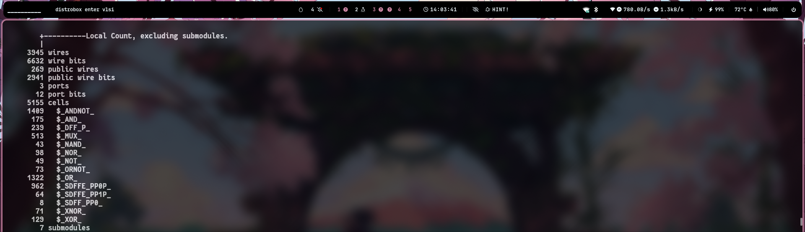
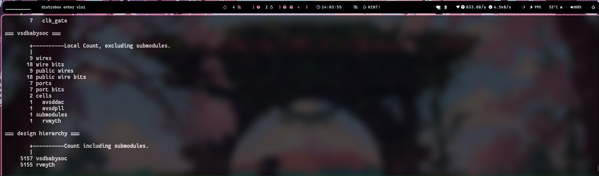
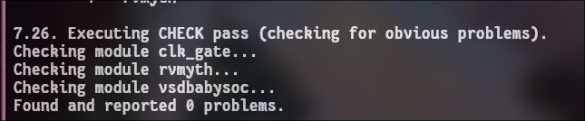
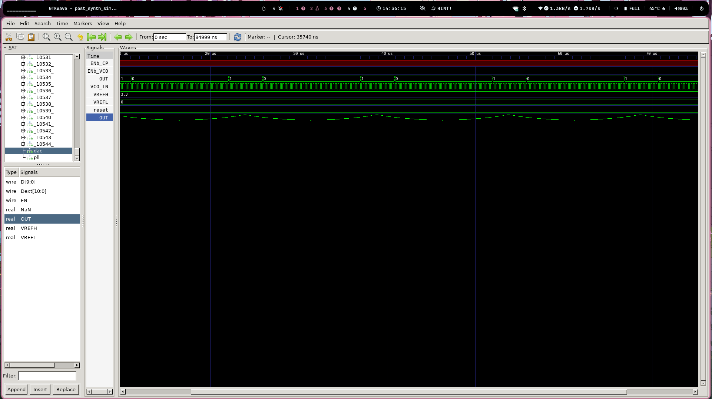
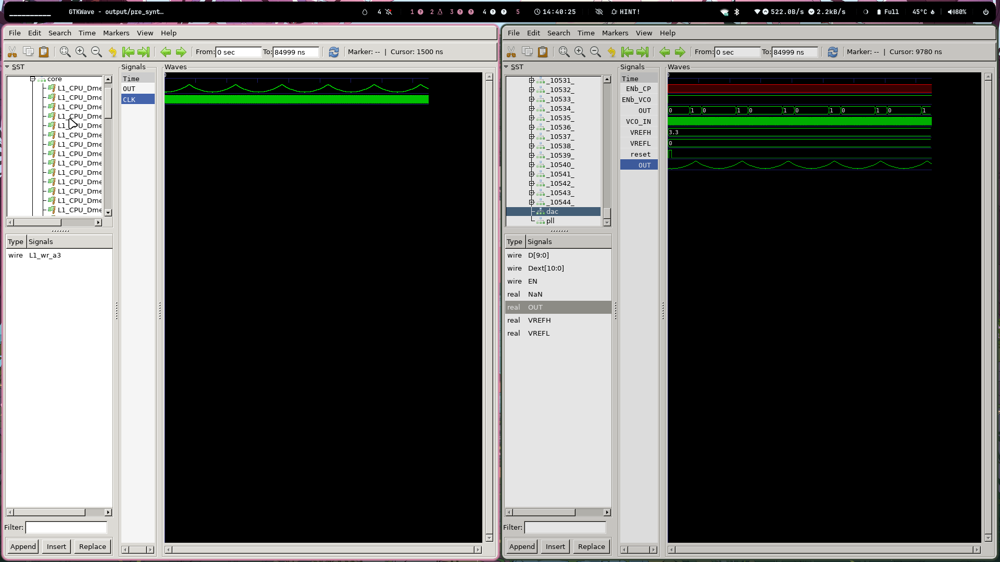

Gate-Level Simulation (GLS) of BabySoC
POST-SYNTHESIS SIMULATION

    Purpose of Gate-Level Simulation (GLS): Gate-Level Simulation is a critical step to verify the functionality of a design after it has been synthesized. Unlike behavioral or RTL simulations, which operate at a higher level of abstraction, GLS works directly on the post-synthesis netlist. This netlist is a detailed representation of the design, comprising the actual logic gates and their interconnections as they will be implemented in hardware.

Key Aspects of GLS for BabySoC

    Verification with Timing Information

        GLS is performed using Standard Delay Format (SDF) files to ensure timing correctness.

        This checks if the SoC behaves as expected under real-world timing constraints.

    Design Validation Post-Synthesis

        Confirms that the design's logical behavior remains correct after mapping it to the gate-level representation.

        Ensures that the design is free from issues like metastability or glitches.

    Simulation Tools

        Tools like Icarus Verilog or a similar simulator can be used for compiling and running the gate-level netlist.

        Waveforms are typically analyzed using GTKWave.

    Importance for BabySoC

        BabySoC consists of multiple modules like the RISC-V processor, PLL, and DAC. GLS ensures that these modules interact correctly and meet the timing requirements in the synthesized design.

Synthesis and Simulation Execution Plan

Here is the step-by-step plan for running synthesis and post-synthesis simulation manually from the root project directory.
Synthesis using Yosys

First, start the Yosys synthesis tool from your terminal.

yosys


Once inside the Yosys shell, execute the following commands in sequence.
Step 1: Load the Top-Level Design and Supporting Modules

read_verilog src/module/vsdbabysoc.v
read_verilog -I src/include src/module/rvmyth.v
read_verilog -I src/include src/module/clk_gate.v

jjjjjj
Step 2: Load the Liberty Files for Synthesis

read_liberty -lib src/lib/avsdpll.lib
read_liberty -lib src/lib/avsddac.lib
read_liberty -lib src/lib/sky130_fd_sc_hd__tt_025C_1v80.lib

<!-- Add a screenshot of the terminal output after loading liberty files here -->
Step 3: Run Synthesis Targeting vsdbabysoc

synth -top vsdbabysoc






Step 4: Map D Flip-Flops to Standard Cells

dfflibmap -liberty src/lib/sky130_fd_sc_hd__tt_025C_1v80.lib

Step 5: Perform Final Clean-Up and Renaming

flatten
setundef -zero
clean -purge
rename -enumerate

<!-- Add a screenshot of the cleanup process output here -->
Step 6: Check Statistics

stat

<!-- Add a screenshot of the statistics report here -->
Post-Synthesis Simulation and Waveforms

After generating the synthesized netlist and exiting Yosys, run the following commands in your terminal from the project's root directory.
Step 1: Compile the Testbench

Run the following iverilog command to compile the testbench:

iverilog -o output/post_synth_sim/post_synth_sim.out -DPOST_SYNTH_SIM -DFUNCTIONAL -DUNIT_DELAY=#1 -I src/include -I src/module src/module/testbench.v

alternatively running the command. the make file automate the synthesis.

make sure to follow the given documentation for troubleshoot
https://github.com/manili/VSDBabySoC

```
make synth 

```

Step 2: Navigate to the Post-Synthesis Simulation Output Directory

cd output/post_synth_sim/

Step 3: Run the Simulation

./post_synth_sim.out

Step 4: View the Waveforms in GTKWave

gtkwave post_synth_sim.vcd



### presynth vs post syth output 


<!-- Add screenshots of the final waveforms as viewed in GTKWave here -->
