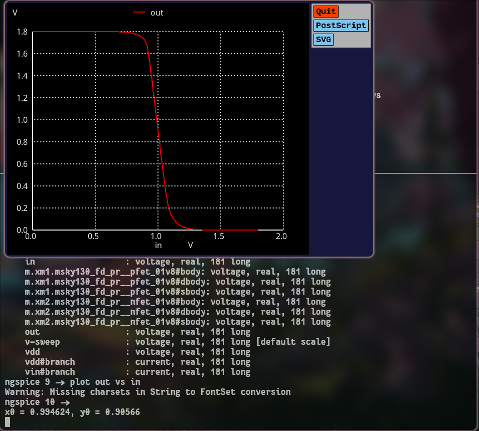

# Week 4 – CMOS Circuit Design (sky130-style)

## Why This Task Matters
This task deepens understanding of how transistor-level properties — including device physics, sizing, and variation — affect circuit timing analyzed in Static Timing Analysis (STA).  
By modeling and simulating circuits in SPICE, the connection between transistor-level effects and system-level performance becomes evident — improving intuition about slack, delay, noise margins, and variation.

> *Hint for image:* insert an overview diagram of CMOS design flow or STA timing relation here.

---

## Task Components

### 1. MOSFET Behavior – Id vs Vds
Simulate an NMOS device while sweeping \( V_{DS} \) for different \( V_{GS} \) values to observe linear and saturation regions.  
**Plot:** \( I_D \) vs \( V_{DS} \)

> *Hint for image:* include Id–Vds curves showing linear to saturation transition with region labels.

---

### 2. Threshold Voltage & Velocity Saturation
Perform a \( V_{GS} \)-sweep to extract threshold voltage (Vt) by linear extrapolation from the Id–Vgs curve.  
Observe velocity saturation effects in short-channel NMOS transistors.

> *Hint for image:* show extracted threshold point on Id–Vgs plot and inset highlighting velocity saturation.

by extrapolation the vt was found to be around 7.5v

---

### 3. CMOS Inverter – Voltage Transfer Characteristic (VTC)
- Build a CMOS inverter (PMOS + NMOS).
- Sweep the input and measure the output to plot the **VTC curve**.
- Identify the switching threshold \( V_m \), where \( V_{in} = V_{out} \).

> *Hint for image:* add a labeled VTC curve with Vm marked.

the swiching threshold is around 8.5v
---

### 4. Transient Behavior – Rise/Fall Delays
Apply a **pulse input** to the inverter and analyze transient output to calculate:
- **Rise delay:** time for output to rise past \( V_{DD}/2 \)
- **Fall delay:** time for output to fall past \( V_{DD}/2 \)

> *Hint for image:* include overlay of input/output waveforms showing delay intervals.

from the transient analysis the rise and fall delay was around .32 nano sec and .28 nano sec respectively 

---

### 5. Noise Margin and Robustness
From the VTC:
- Identify \( V_{IL}, V_{IH}, V_{OL}, V_{OH} \)
- Calculate noise margins:
  \[
    NML = V_{IL} - V_{OL}, \quad NMH = V_{OH} - V_{IH}
  \]

> *Hint for image:* annotate NML and NMH directly on the VTC plot.

from the given analysis the noise margin high is 0.752 and low is 0.638

---

### 6. Power-Supply and Device Variation Studies
Investigate:
- **Supply variation:** change \( V_{DD} \) and observe VTC shift.
- **Device variation:** modify W/L of transistors and analyze switching threshold and delay impact.

> *Hint for image:* compare multiple VTC plots for different \( V_{DD} \) or W/L ratios.
observation from the image it was observed that the switching voltage was shifted to right due to the change in width of channel to the right 

while the powersupply changed the switching chara was also changed

---

## Deliverables

| Section | Content Description |
|----------|--------------------|
| Introduction | Purpose and motivation of each simulation |
| SPICE Netlists | Include Id–Vds, Id–Vgs, VTC, transient, and variation simulation files |
| Plots & Figures | Id–Vds, Id–Vgs, VTC, transient waveforms, variation results |
| Tabulated Results | Threshold voltage, propagation delays, noise margins, variation outcomes |
| Observations & Analysis | Device-level reasoning and physical explanation |
| Conclusions | Summary of relation between transistor characteristics and circuit timing |

> *Hint for image:* include a schematic of CMOS inverter or simulation environment here.

---

## Observations / Analysis
- **Saturation region** defines constant-current behavior, critical in amplifier and inverter design.
- **Threshold voltage** depends on channel length and oxide thickness; variation impacts switching threshold.
- **Inverter delay** is proportional to device sizing and load capacitance.
- **Supply and size variations** correlate directly with STA margin shifts.

> *Hint for image:* use waveform overlays comparing delays for nominal and varied conditions.

---

## Conclusions
- Transistor-level operation fundamentally governs digital timing performance and logic robustness.
- STA accuracy depends on understanding physical variation and parasitics observed in transistor simulations.
- System reliability can be enhanced by considering VDD scaling and process spread during design.

---

## References
- [sky130CircuitDesignWorkshop – GitHub](https://github.com/kunalg123/sky130CircuitDesignWorkshop)
- SkyWater PDK Model Files and Documentation
- Open-source SPICE simulations using Ngspice and Magic Layout Tools

